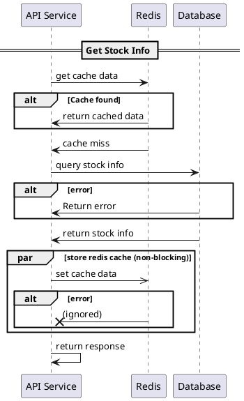
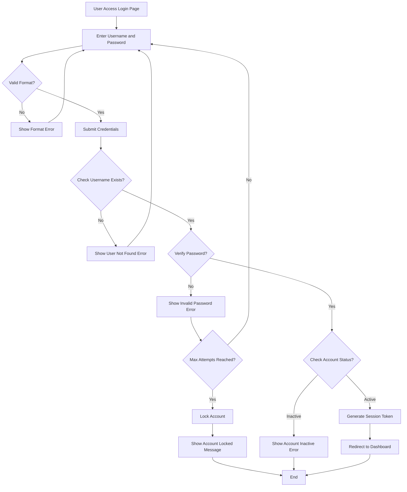

import MdxImage from "../component/mdx/MdxImage";

In the role of a software engineer, although you are not an architect, using diagrams in daily work is very helpful to understand systems and communicate with others. Here are some diagrams that I use in my daily work and the tools I use to create them in the fastest way.

## Sequence Diagram

A sequence diagram is a type of interaction diagram that shows how processes operate with one another and in what order. It is a great way to visualize the flow of messages between different components in a system.

For creating sequence diagrams, I recommend using [PlantUML](https://plantuml.com/sequence-diagram). It is a simple and powerful tool that allows you to create sequence diagrams using a plain text language. You can easily integrate it with your code editor or use it online.

You can easily install PlantUML with Visual Studio Code

<MdxImage src="/blog/design-diagram-tools_1.png" alt="design-diagram-tools_1" />

In this example, I will show you the flow for the Get Stock Info API. The sequence diagram shows the interaction between the API service, Redis cache, and the database.

In the flow, we will check the cache from Redis first. If cache is found, we will return the cached data. If cache is not found, we will query the database for stock info. If there is an error in the database, we will return an error response. Finally, we will store the stock info in Redis cache for future requests.



<MdxImage src="/blog/design-diagram-tools_2.png" alt="design-diagram-tools_2" />

After you see the code for PlantUML, I know that it seems hard to write the whole code.

You might think you must write the whole code from scratch.

But... in 2025, it is the AI era. You can use AI to generate the initial code for you and edit just a few parts later. For me, it is one of the best ways to use AI because this is a partial task you may not be concerned about code quality for - you just want to have code that can generate the diagram for you, and AI does it very well.

Here's the example prompt:

```
Create a PlantUML sequence diagram with:

Title: "Get Stock Info"
3 participants: API Service, Redis, Database
Flow: API checks Redis cache first
If cache found, return cached data
If cache miss, query database
Include alt block for database errors
Add async Redis cache update using 'par' block
```

This prompt might not give you exactly what I show, but it helps you avoid writing it from scratch, and I'm pretty sure that you can read it and edit it without spending any time learning PlantUML code syntax.

## Flowchart

Flowcharts are another diagram that I use frequently to visualize the flow of processes or algorithms. They are particularly useful for understanding complex logic and decision-making paths.

> This diagram type is different from sequence diagrams, as it focuses on the flow of control rather than the interaction between components.

For creating flowcharts, I recommend using [Mermaid](https://mermaid.js.org). It is a simple and powerful tool that allows you to create flowcharts using a plain text language. You can easily integrate it with your code editor or use it online.

<MdxImage src="/blog/design-diagram-tools_3.png" alt="design-diagram-tools_3" />

In this example, I'll show you a flowchart for a user login process. This diagram illustrates the complete authentication flow including input validation, credential verification, and account security checks.



<MdxImage src="/blog/design-diagram-tools_4.png" alt="design-diagram-tools_4" />

The flowchart shows the complete user login process, including format validation, credential verification, account status checks, and security measures like account locking after maximum failed attempts.

As the same as the sequence diagram, you can use AI to generate the initial code for you and edit just a few parts later. Here's an example prompt:

```
Create a Mermaid flowchart with:

- Start: User accesses login page
- Input validation for username/password format
- Submit credentials and check if username exists
- Verify password with error handling
- Check account status (active/inactive)
- Track failed login attempts and lock account after max attempts
- Generate session token and redirect on successful login
- Include all error paths and end states
- Use decision diamonds for conditionals
```

This prompt will generate the flowchart structure you need, and you can easily modify the text and flow as needed.

> Actually, Mermaid can generate many type of diagrams, not just flowcharts. You can use it to create sequence diagrams, ER diagrams, Gantt charts, and more. But I think there is another tool that is better.

## ER Diagram

Entity-Relationship (ER) diagrams are essential for visualizing the structure of a database. They help you understand how entities relate to each other, which is crucial for designing and maintaining databases.

For creating ER diagrams, There are two tools I recommend. If you want to using in visual code I recommend [bigER Modeling Tool](https://marketplace.visualstudio.com/items?itemName=BIGModelingTools.erdiagram) and If you like to use in online I highly recommend [dbdiagram.io](https://dbdiagram.io). Both are powerful tool that allows you to create ER diagrams from code.

<MdxImage src="/blog/design-diagram-tools_5.png" alt="design-diagram-tools_5" />

<MdxImage src="/blog/design-diagram-tools_6.png" alt="design-diagram-tools_6" />

---
